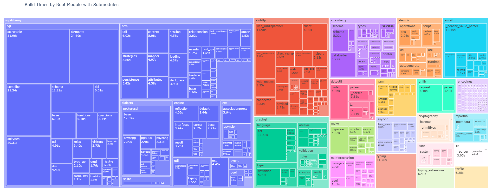

# Nuitka Compile Report Parser

Parses a [Nuitka](https://nuitka.net/) compilation report XML file and generates a self-contained HTML report with interactive visualizations.



## Output

The generated HTML report includes:

- **Command line** — the Nuitka command used for the build
- **Plugin options** — table of enabled/disabled Nuitka plugins
- **Build time summary** — total compile time, module count, and interactive charts of build times by root module (with submodule breakdown)
- **Build size summary** — total bytecode size, module count, and interactive charts of bytecode sizes by root module
- **Dependency graph** — interactive scatter plot showing relationships between your project's own modules

The build time and build size sections each offer three switchable chart types:

- **Bar chart** — stacked horizontal bars grouped by root module
- **Treemap** — hierarchical rectangles sized proportionally to values
- **Sunburst** — radial hierarchy with root modules in the inner ring and submodules in the outer ring

> **Note:** The report does not include C compilation information, as the Nuitka compile report XML does not contain this data.

## Installation

Requires Python 3.11+.

```sh
pip install git+https://github.com/Bingdom/Nuitka-Compile-Report-Parser
```

## Usage

### Command line

```sh
nuitka-reporter <report> [output]
```

| Argument | Required | Description                                                                    |
| -------- | -------- | ------------------------------------------------------------------------------ |
| `report` | Yes      | Path to the Nuitka compilation report XML file (e.g. `compilation-report.xml`) |
| `output` | No       | Output HTML file path. Defaults to `./report.html`                             |

You can also run it as a Python module:

```sh
python3 -m nuitka_reporter "compilation-report.xml"
python3 -m nuitka_reporter "compilation-report.xml" "my-report.html"
```

Or run directly without installing:

```sh
uvx git+https://github.com/Bingdom/Nuitka-Compile-Report-Parser "compilation-report.xml"
pipx run --spec git+https://github.com/Bingdom/Nuitka-Compile-Report-Parser nuitka-reporter "compilation-report.xml"
```

### As a library

```python
import nuitka_reporter

output_dir = nuitka_reporter.to_html("compilation-report.xml")
# or specify an output path
output_dir = nuitka_reporter.to_html("compilation-report.xml", "my-report.html")
```
